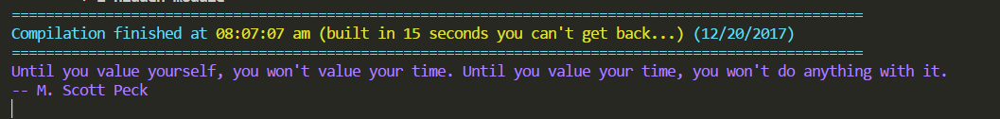

# get-random-quote [](https://travis-ci.org/kdelmonte/get-random-quote)
Gets a random quote for you using the [Forismatic API](https://forismatic.com/en/api/). Great for giving your team some inspiration after a build :grinning:.



## Usage
```
import getRandomQuote from 'get-random-quote';

getRandomQuote
    .then((quote) => {
        console.log(quote);
        //{ 
        //    author: 'Edwin Chapin', 
        //    text: 'Every action of our lives touches on some chord that will vibrate in eternity.' 
        //}
    });

```

## Installation

`npm install get-random-quote`

## Run Test

`npm run test` or `ava`